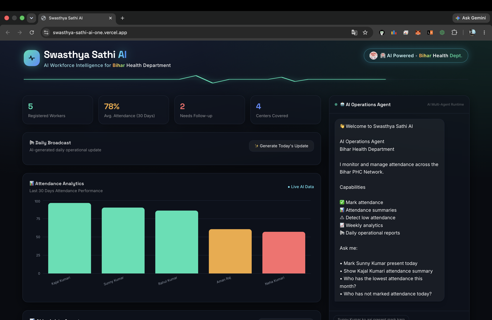

# Swasthya Sathi AI

**An AI agent that manages rural health worker attendance in plain Hindi/English — not a chatbot skin on a form.**

Built for the Google AI Agent Builder Series 2026 (HiDevs).



<br>

## The Problem

Bihar's PHC (Primary Health Centre) network runs on hundreds of ASHA, ANM, and Anganwadi workers spread across rural sub-centers. Supervisors currently track their attendance manually — in paper registers or WhatsApp groups. There's no visibility into who's underperforming until it's already too late to act.

I built this to fix that.

<br>

## This Is an Agent, Not a Form

Most "AI attendance" tools just wrap a chat UI around a database. This project takes a different approach — Gemini is given a set of real Python tools (`mark_attendance`, `get_attendance_summary`, `find_low_attendance_workers`, `who_has_not_marked_today`, `list_workers`), and the model decides on its own, turn by turn, which tool(s) to call and in what order — using Gemini's automatic function calling.

A supervisor can type:

> "Sunny Kumar ko aaj half-day mark karo aur uska is month ka summary dikhao"

...and the agent will chain two tool calls automatically, then reply in the same language the supervisor used. Every tool call the agent actually performs is shown back as a small audit-trail chip, so nothing happens silently in the background.

**The proactive feature:** `find_low_attendance_workers` lets a supervisor simply ask "who's underperforming this month?" and the agent flags anyone below a configurable threshold — turning a reactive register into something that surfaces problems before they escalate.

<br>

## Tech Stack

| Layer | Choice |
|---|---|
| Agent / LLM | Gemini 2.0 Flash, Python SDK, automatic function calling |
| Backend | FastAPI + SQLAlchemy + SQLite |
| Frontend | React 18 + Vite + Tailwind CSS + Recharts |
| Deploy | Render (backend) + Vercel (frontend), Docker also included |

<br>

 ## Project Structure

```text
swasthya-sathi-ai/
├── backend/
│   ├── main.py              # FastAPI app, REST + /api/chat
│   ├── agent.py             # Gemini agent + tool functions
│   ├── models.py            # SQLAlchemy models
│   ├── schemas.py           # Pydantic schemas
│   ├── database.py          # SQLite session setup
│   ├── seed.py              # Demo data generator
│   ├── requirements.txt
│   ├── .env.example
│   └── Dockerfile
│
├── frontend/
│   ├── src/
│   │   ├── App.jsx
│   │   ├── api.js
│   │   └── components/
│   │       ├── Header
│   │       ├── StatCards
│   │       ├── AttendanceChart
│   │       ├── WorkerTable
│   │       ├── ChatAgent
│   │       └── PulseDivider
│   ├── package.json
│   └── Dockerfile
│
├── assets/
├── docker-compose.yml
├── render.yaml
└── DEMO_SCRIPT.md
```


<br>

## 🚀 Run Locally

### 1. Get a free Gemini API Key

Visit: https://aistudio.google.com/apikey

---

### 2. Backend

```bash
cd backend

cp .env.example .env
# Paste your GEMINI_API_KEY into the .env file

pip install -r requirements.txt --break-system-packages

python seed.py
# Creates 5 demo workers with 30 days of attendance history

uvicorn main:app --reload --port 8000
```

---

### 3. Frontend

Open a **new terminal** and run:

```bash
cd frontend

npm install

npm run dev
```

Open your browser and visit:

```text
http://localhost:5173
```

The dashboard will appear on the left, and the AI Agent chat interface will appear on the right.

---

### 🐳 Run with Docker

```bash
cp backend/.env.example backend/.env
# Add your GEMINI_API_KEY to backend/.env

docker compose up --build
```


 


## Deploy (for the submission link)

**Backend → Render**

1. Push this repo to GitHub.
2. New → Blueprint on Render, point it at your repo (uses `render.yaml`).
3. Set `GEMINI_API_KEY` in the Render dashboard's environment tab.
4. Note the live URL, e.g. `https://swasthya-sathi-ai-backend.onrender.com`.

**Frontend → Vercel**

1. Import the repo, set root directory to `frontend`.
2. Add environment variable `VITE_API_URL` = your Render backend URL.
3. Deploy. Vercel gives you the public link for the HiDevs submission form.

<br>

## Try These in the Chat

- "Sunny Kumar ko aaj present mark karo"
- "Is month kaun sabse kam attendance wala hai?"
- "Kajal Kumari ka attendance summary dikhao"
- "Aaj kisne attendance nahi mark ki?"
- "Neha Kumari ko kal absent mark karo, reason: bimar thi"

<br>

## Contributing

Contributions are welcome! Check the [Issues](../../issues) tab for `good first issue` labeled tasks. Fork the repo, create a branch, and submit a PR — see individual issues for setup details.

<br>

## Author

Sunny Kumar — Co-Organizer & Tech Lead, GDG On Campus BCE Patna · Beta MLSA · GFG Campus Mantri


