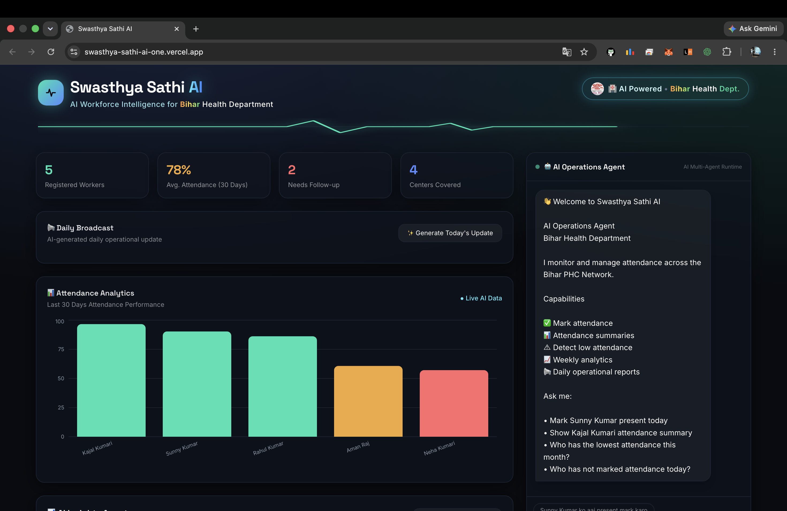

# 🩺 Swasthya Sathi AI

<p align="center">


</p>

<p align="center">
<b>AI-powered attendance management for rural healthcare workers.</b><br>
Built using <b>Gemini Function Calling + FastAPI + React</b> for the <b>Google AI Agent Builder Series 2026</b>.
</p>

---

## 🌐 Live Demo

| Service | Link |
|---------|------|
| 🚀 Frontend | https://swasthya-sathi-ai-one.vercel.app |
| ⚙️ Backend API | https://swasthya-sathi-ai.onrender.com |
| 📚 API Docs | https://swasthya-sathi-ai.onrender.com/docs |

---

## 📸 Preview



---

## 📖 About the Project

Swasthya Sathi AI is an AI-powered attendance management system designed for rural healthcare organizations. It combines a modern React dashboard with a FastAPI backend and Google's Gemini Function Calling to help supervisors manage attendance using natural language.

The AI agent can understand user requests, invoke backend tools automatically, and provide attendance insights without requiring users to navigate complex interfaces.

---

## 🚑 Problem Statement

Primary Health Centres across rural India depend on ASHA, ANM and Anganwadi workers.

Attendance is commonly managed using:

- Paper registers
- WhatsApp groups
- Excel sheets

This makes it difficult for supervisors to:

- Track attendance efficiently
- Monitor attendance trends
- Identify low-performing workers
- Generate attendance summaries quickly

Swasthya Sathi AI transforms attendance tracking into an intelligent AI-powered workflow.

---

## 🤖 Why This Isn't Just Another Chatbot

Instead of generating plain text responses, Gemini receives access to real backend tools and automatically decides which function should run.

### Example

```text
Sunny Kumar ko present mark karo

phir uska monthly summary dikhao
```

The AI Agent automatically chains backend tool calls like:

```text
mark_attendance()

↓

get_attendance_summary()
```

No manual workflow logic is required.

---

## ✨ Features

- 🤖 Gemini Function Calling
- 🌐 Hindi & English conversations
- 👨‍⚕️ Healthcare worker management
- 📅 Attendance tracking
- 📊 Analytics dashboard
- 📈 Interactive charts
- 🚨 Low-attendance detection
- ⚡ FastAPI REST APIs
- 📱 Responsive React UI
- 🐳 Docker support
- ✅ GitHub Actions CI

---

## 🏗 System Architecture

```text
                  User
                    │
                    ▼
         React + Vite Frontend
                    │
               REST API
                    │
                    ▼
            FastAPI Backend
                    │
      Gemini Function Calling
      ┌─────────┼──────────┐
      ▼         ▼          ▼
 Attendance  Analytics   Workers
                    │
                    ▼
             SQLite Database
```

---

## ⚡ Tech Stack

| Layer | Technology |
|--------|------------|
| AI | Gemini 2.0 Flash |
| Backend | FastAPI |
| ORM | SQLAlchemy |
| Database | SQLite |
| Frontend | React + Vite |
| Styling | Tailwind CSS |
| Charts | Recharts |
| Testing | Pytest |
| CI/CD | GitHub Actions |
| Container | Docker |
| Deployment | Render + Vercel |

---

## 📂 Project Structure

```text
swasthya-sathi-ai/
├── backend/
├── frontend/
├── assets/
├── .github/
│   └── workflows/
├── docker-compose.yml
├── render.yaml
└── README.md
```

---

## 📖 REST APIs

| Method | Endpoint | Description |
|--------|----------|-------------|
| GET | `/api/workers` | List workers |
| GET | `/api/attendance` | Attendance records |
| POST | `/api/chat` | AI Agent |
| POST | `/api/attendance` | Mark attendance |

---

## 🚀 Local Setup

### Backend

```bash
cd backend
cp .env.example .env
pip install -r requirements.txt
python seed.py
uvicorn main:app --reload
```

### Frontend

```bash
cd frontend
cp .env.example .env
npm install
npm run dev
```

Open:

```text
http://localhost:5173
```

---

## 🐳 Docker

```bash
cp backend/.env.example backend/.env
docker compose up --build
```

---

## ☁️ Deployment

- **Frontend:** Vercel
- **Backend:** Render
- **Database:** SQLite

---

## 💬 Example Prompts

```text
Sunny Kumar ko present mark karo

Kajal Kumari ki attendance dikhao

Is month sabse kam attendance kiski hai?

Aaj kisne attendance nahi lagayi?

Kal absent mark karo
```

---

## 🧪 Testing

Run backend tests:

```bash
pytest
```

GitHub Actions automatically runs backend tests on every push and pull request.

---

## 🛣 Roadmap

### ✅ Completed

- AI Agent
- Gemini Function Calling
- Dashboard
- Attendance Analytics
- REST APIs
- Docker Support
- CI/CD
- Deployment

### 🚀 Planned

- Authentication
- Voice Assistant
- WhatsApp Integration
- SMS Alerts
- Export Reports (PDF)
- Notifications
- Multi-language Support

---

## 🤝 Contributing

Contributions are welcome!

1. Fork this repository.
2. Create a feature branch.

```bash
git checkout -b feature-name
```

3. Commit your changes.

```bash
git commit -m "Add feature"
```

4. Push your branch.

```bash
git push origin feature-name
```

5. Open a Pull Request.

---

## ⭐ Support

If you found this project useful, please consider giving it a ⭐ on GitHub.

---

## 👨‍💻 Author

**Sunny Kumar**

- 🎓 B.Tech CSE, Bakhtiyarpur College of Engineering
- 🚀 Co-Organizer & Tech Lead — GDG On Campus BCE Patna
- 🌟 Beta MLSA
- 🤖 Google Student Ambassador

**GitHub:** https://github.com/SunnyAgrwl05

**LinkedIn:** https://www.linkedin.com/in/sunny-kumar-a06484297

---

## 📜 License

This project is licensed under the **MIT License**.
